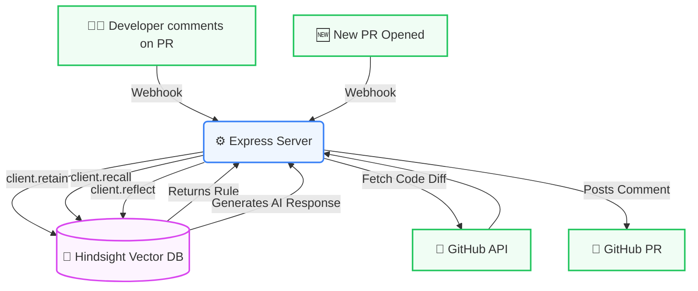

# 🏗️ Architecture & App Flow

## 🔄 App Flow
1. **Retain Phase:** A developer leaves a comment on GitHub. A webhook triggers DevLore.
2. **Memory Storage:** DevLore saves the rule to the Hindsight Vector DB.
3. **Recall Phase:** A new PR is opened. DevLore fetches the code diff and asks Hindsight if any rules apply.
4. **Reflect Phase:** DevLore automatically posts a coaching comment on the PR.

## 🛠️ Technology Stack
* **Backend:** Node.js (v24), Express.js
* **Database:** Hindsight Vector DB (by Vectorize)
* **Frontend:** Vanilla HTML/CSS (Glassmorphism, CSS Grid)
* **Integrations:** GitHub Webhooks, native `fetch` API

## 📂 Folder Structure
```text
DevLore/
├── public/
│   └── index.html      # Glassmorphism Dashboard UI
├── docs/               # Project Documentation
├── server.js           # Core Express backend & Webhook logic
├── README.md           # Project Pitch
├── package.json        # Dependencies
└── .env                # Hindsight & GitHub API Keys
```

## 📊 System Architecture Diagram

